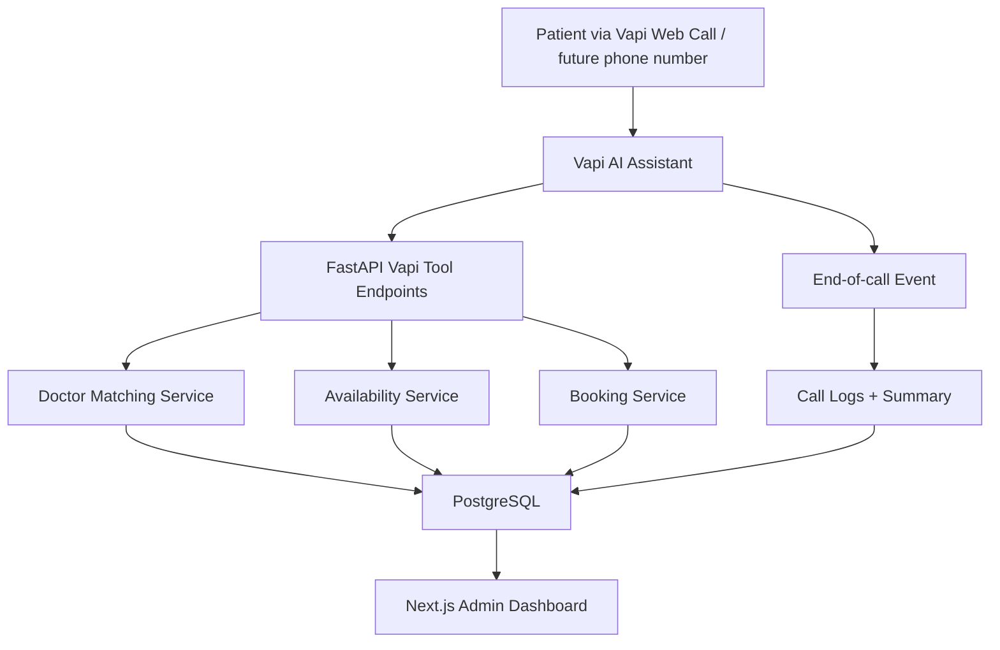

# AI Hospital Voice Receptionist

AI-powered hospital voice receptionist using Vapi, FastAPI, PostgreSQL, and
Next.js to route patients, check doctor availability, book appointments, and
maintain official appointment and call records.

This repository is a private official-system monorepo. The first test path is
Vapi Web Calls. The hospital's own phone number can be attached after the
backend, database, Vapi tools, and dashboard are verified.

## Architecture



## Tech Stack

- Voice AI: Vapi assistant, API Request/custom tools, Web Calls for testing
- Backend: FastAPI, SQLAlchemy, Alembic, Pydantic, python-dotenv
- Database: PostgreSQL
- Frontend: Next.js App Router, TypeScript, Tailwind, shadcn/ui
- Local infrastructure: Docker Compose, ngrok or cloudflared tunnel

## Repo Structure

```txt
ai-hospital-voice-receptionist/
  backend/
  frontend/
  docs/
  infra/
  scripts/
  README.md
  .env.example
  .gitignore
  docker-compose.yml
```

## Vapi Tool Flow

```txt
matchDoctorBySymptoms -> POST /vapi/tools/match-doctor
checkAvailability     -> POST /vapi/tools/check-availability
bookAppointment       -> POST /vapi/tools/book-appointment
endOfCall             -> POST /vapi/events/end-of-call
```

All Vapi-facing endpoints must require:

```txt
Authorization: Bearer <VAPI_TOOL_SECRET>
```

## Database

The full schema plan is in [docs/DATABASE_SCHEMA.md](docs/DATABASE_SCHEMA.md).

Core tables:

```txt
hospitals
departments
doctors
doctor_routing_keywords
patients
doctor_schedules
schedule_exceptions
appointments
call_logs
vapi_tool_calls
admin_users
audit_logs
```

PostgreSQL is the source of truth. Google Sheets is not part of the primary
system and can be added later only as an export/integration.

## Local Setup

The backend foundation is implemented with FastAPI, SQLAlchemy models, Alembic
migration, seed data, Vapi tool endpoints, auth endpoints, protected admin
read/update endpoints, and focused tests.

Planned local flow:

```bash
cp .env.example .env
docker compose up -d
cd backend
python -m venv .venv
pip install -r requirements.txt
alembic upgrade head
uvicorn app.main:app --reload
```

Expose the backend for Vapi Web Call testing:

```bash
ngrok http 8000
```

Then use the HTTPS tunnel URL in Vapi tools:

```txt
https://your-tunnel-url/vapi/tools/match-doctor
https://your-tunnel-url/vapi/tools/check-availability
https://your-tunnel-url/vapi/tools/book-appointment
```

## Environment Variables

See [.env.example](.env.example). Never commit `.env` or real credentials.

Minimum planned variables:

```txt
DATABASE_URL
APP_SECRET_KEY
PII_ENCRYPTION_KEY
VAPI_TOOL_SECRET
ADMIN_BOOTSTRAP_EMAIL
ADMIN_BOOTSTRAP_PASSWORD
```

## API Testing Examples

Match doctor:

```bash
curl -X POST http://localhost:8000/vapi/tools/match-doctor \
  -H "Authorization: Bearer $VAPI_TOOL_SECRET" \
  -H "Content-Type: application/json" \
  -d "{\"symptoms\":\"eye pain and blurry vision\"}"
```

Check availability:

```bash
curl -X POST http://localhost:8000/vapi/tools/check-availability \
  -H "Authorization: Bearer $VAPI_TOOL_SECRET" \
  -H "Content-Type: application/json" \
  -d "{\"doctor_id\":\"<doctor_uuid>\",\"date\":\"2026-07-10\"}"
```

Book appointment:

```bash
curl -X POST http://localhost:8000/vapi/tools/book-appointment \
  -H "Authorization: Bearer $VAPI_TOOL_SECRET" \
  -H "Content-Type: application/json" \
  -d "{\"patient_name\":\"Ali Khan\",\"phone\":\"+923001234567\",\"doctor_id\":\"<doctor_uuid>\",\"date\":\"2026-07-10\",\"start_time\":\"10:00\",\"reason\":\"eye pain\"}"
```

## Security Notes

- The assistant routes appointments; it must not diagnose or provide medical
  advice.
- PII fields are encrypted at rest.
- Phone lookup uses a hash, not raw phone matching.
- Logs must not contain raw names, phones, reasons, transcripts, or secrets.
- Booking must use a database transaction and unique constraint to prevent
  double booking.
- Full transcripts and recordings should stay disabled unless explicit client
  consent and retention rules are documented.

See [docs/SECURITY_RISK_REGISTER.md](docs/SECURITY_RISK_REGISTER.md).

## Roadmap

1. Documentation and private GitHub repo skeleton
2. Backend models, migrations, and seed data
3. Vapi tool APIs
4. Manual API tests
5. Vapi Web Call test flow
6. Admin dashboard
7. Security hardening
8. Attach official hospital number

## Demo Status

Current status: backend foundation implemented and tested.

Next milestone: connect the backend to a live local PostgreSQL database, run
the seed script, expose it through a tunnel, and attach the three Vapi Web Call
tools for an end-to-end voice booking test.
