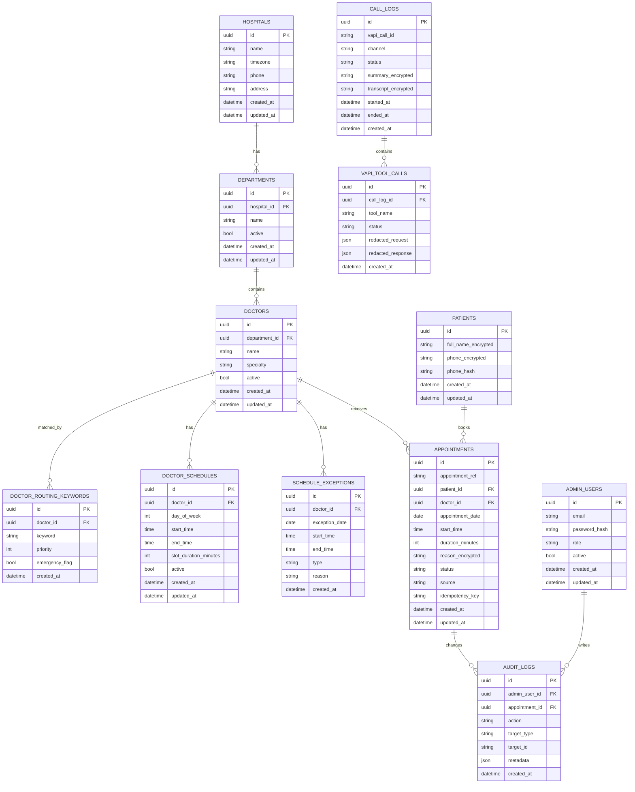

# Database Schema

PostgreSQL is the source of truth. All implementation should start from this
schema and revise it intentionally through Alembic migrations.

## ERD



## Table Details

### `hospitals`

Single hospital profile for v1.

Required fields:

```txt
id uuid primary key
name varchar not null
timezone varchar not null default 'Asia/Karachi'
phone varchar nullable
address text nullable
created_at timestamptz not null
updated_at timestamptz not null
```

### `departments`

Groups doctors for routing and dashboard filters.

Required fields:

```txt
id uuid primary key
hospital_id uuid not null references hospitals(id)
name varchar not null
active boolean not null default true
created_at timestamptz not null
updated_at timestamptz not null
```

Constraint:

```txt
unique(hospital_id, lower(name))
```

### `doctors`

Doctor records used by routing and booking.

Required fields:

```txt
id uuid primary key
department_id uuid not null references departments(id)
name varchar not null
specialty varchar not null
active boolean not null default true
created_at timestamptz not null
updated_at timestamptz not null
```

### `doctor_routing_keywords`

Keyword matching table for safe symptom routing.

Required fields:

```txt
id uuid primary key
doctor_id uuid not null references doctors(id)
keyword varchar not null
priority int not null default 100
emergency_flag boolean not null default false
created_at timestamptz not null
```

Example seed keywords:

```txt
eye pain, blurry vision -> Ophthalmology
chest pain, severe shortness of breath -> emergency flag
skin rash, itching -> Dermatology
tooth pain -> Dentistry
fever, cough -> General Physician
```

### `patients`

Patient identity table with encrypted PII.

Required fields:

```txt
id uuid primary key
full_name_encrypted text not null
phone_encrypted text not null
phone_hash varchar not null unique
created_at timestamptz not null
updated_at timestamptz not null
```

Rules:

- Normalize phone before hashing.
- Use `phone_hash` for lookup.
- Never log decrypted values.

### `doctor_schedules`

Recurring weekly availability.

Required fields:

```txt
id uuid primary key
doctor_id uuid not null references doctors(id)
day_of_week int not null
start_time time not null
end_time time not null
slot_duration_minutes int not null default 30
active boolean not null default true
created_at timestamptz not null
updated_at timestamptz not null
```

Rules:

- `day_of_week` uses ISO values: Monday `1` through Sunday `7`.
- `end_time` must be greater than `start_time`.
- Slots are generated dynamically from schedules and exceptions.

### `schedule_exceptions`

One-off blocked or added availability.

Required fields:

```txt
id uuid primary key
doctor_id uuid not null references doctors(id)
exception_date date not null
start_time time not null
end_time time not null
type varchar not null
reason varchar nullable
created_at timestamptz not null
```

Allowed types:

```txt
blocked
extra
leave
holiday
```

### `appointments`

Official appointment record.

Required fields:

```txt
id uuid primary key
appointment_ref varchar not null unique
patient_id uuid not null references patients(id)
doctor_id uuid not null references doctors(id)
appointment_date date not null
start_time time not null
duration_minutes int not null default 30
reason_encrypted text nullable
status varchar not null
source varchar not null
idempotency_key varchar nullable unique
created_at timestamptz not null
updated_at timestamptz not null
```

Statuses:

```txt
booked
confirmed
completed
cancelled
no_show
rescheduled
```

Sources:

```txt
vapi_web
vapi_phone
dashboard
manual_api
```

Double-booking rule:

```txt
doctor_id + appointment_date + start_time must be unique for active bookings
```

Implementation note:

PostgreSQL should use a partial unique index where status is not in
`cancelled`, `rescheduled`, or `no_show`.

### `call_logs`

Stores Vapi call metadata and summary.

Required fields:

```txt
id uuid primary key
vapi_call_id varchar not null unique
channel varchar not null
status varchar not null
summary_encrypted text nullable
transcript_encrypted text nullable
started_at timestamptz nullable
ended_at timestamptz nullable
created_at timestamptz not null
```

Channels:

```txt
vapi_web
vapi_phone
```

### `vapi_tool_calls`

Audit table for tool calls.

Required fields:

```txt
id uuid primary key
call_log_id uuid nullable references call_logs(id)
tool_name varchar not null
status varchar not null
redacted_request jsonb nullable
redacted_response jsonb nullable
created_at timestamptz not null
```

Only redacted payloads may be stored.

### `admin_users`

Dashboard users.

Required fields:

```txt
id uuid primary key
email varchar not null unique
password_hash varchar not null
role varchar not null
active boolean not null default true
created_at timestamptz not null
updated_at timestamptz not null
```

Roles:

```txt
admin
doctor
receptionist
viewer
```

### `audit_logs`

Immutable admin/system audit records.

Required fields:

```txt
id uuid primary key
admin_user_id uuid nullable references admin_users(id)
appointment_id uuid nullable references appointments(id)
action varchar not null
target_type varchar not null
target_id varchar nullable
metadata jsonb nullable
created_at timestamptz not null
```

Must log:

```txt
appointment status changes
doctor/schedule changes
admin login failures
data exports
security setting changes
```

## Schema Revision Log

| Version | Date | Change |
|---|---|---|
| v0.1 | 2026-07-09 | Initial planned schema for official single-hospital system. |

