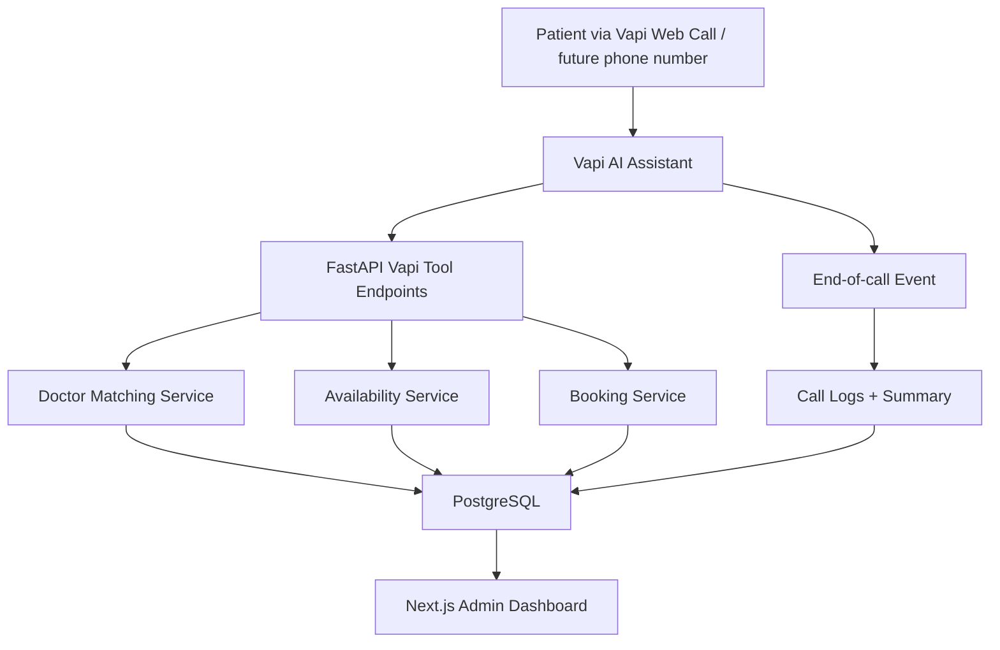

# System Plan

## Purpose

Build an official AI hospital voice receptionist that can answer appointment
calls, collect patient details, route symptoms to the right doctor category,
check availability, book appointments, and preserve appointment/call records.

This is not only a CV demo. The system is planned as a real official record
system, while still being safe to test through Vapi Web Calls before the
hospital provides its own phone number.

## Fixed Decisions

```txt
Repo name: ai-hospital-voice-receptionist
Visibility: private first
Repo shape: monorepo
System shape: single hospital first
Testing: Vapi Web Calls before official number
Database: PostgreSQL source of truth
Security: production-lite
Sheets: later export only
```

## Architecture



## Primary User Flow

1. Patient starts a Vapi Web Call or later calls the hospital number.
2. Assistant greets the patient and asks what they need.
3. Assistant asks for symptoms, preferred date, patient name, and phone.
4. Assistant calls `matchDoctorBySymptoms`.
5. Backend returns a safe doctor/category match.
6. Assistant calls `checkAvailability`.
7. Backend returns free appointment slots.
8. Assistant asks the patient to confirm one slot.
9. Assistant calls `bookAppointment`.
10. Backend stores the patient and appointment.
11. Assistant speaks the appointment reference.
12. End-of-call event stores the call summary.
13. Dashboard shows the appointment and call record.

## Scope

### In Scope For V1

- Single hospital profile
- Doctors and departments
- Doctor routing by safe symptom keywords
- Weekly schedules and schedule exceptions
- Appointment booking and double-booking prevention
- Vapi Web Call testing
- Vapi tool authentication
- End-of-call summary storage
- Admin dashboard for appointments, doctors, schedules, and call logs
- PII encryption and audit logs

### Out Of Scope For V1

- Multi-hospital SaaS
- Billing
- Patient portal
- Google Sheets as database
- Direct diagnosis or medical advice
- Insurance workflows
- Full HIPAA claim
- Real phone number connection until the hospital provides the number

## Backend API Surface

```txt
GET    /health
POST   /auth/login
POST   /auth/logout
GET    /admin/dashboard/summary
GET    /admin/appointments
PATCH  /admin/appointments/{id}
GET    /admin/doctors
POST   /admin/doctors
GET    /admin/call-logs
POST   /vapi/tools/match-doctor
POST   /vapi/tools/check-availability
POST   /vapi/tools/book-appointment
POST   /vapi/events/end-of-call
```

## Vapi Tool Contracts

### `POST /vapi/tools/match-doctor`

Request:

```json
{
  "symptoms": "eye pain and blurry vision"
}
```

Response:

```json
{
  "doctor_id": "uuid",
  "doctor_name": "Dr. Ayesha Khan",
  "specialty": "Ophthalmology",
  "department": "Ophthalmology",
  "reason": "Matched because patient mentioned eye pain and blurry vision.",
  "safety_note": null
}
```

Emergency response shape:

```json
{
  "doctor_id": null,
  "doctor_name": null,
  "specialty": null,
  "department": null,
  "reason": "Symptoms may need urgent care.",
  "safety_note": "Please contact emergency services or visit the emergency department immediately."
}
```

### `POST /vapi/tools/check-availability`

Request:

```json
{
  "doctor_id": "uuid",
  "date": "2026-07-10"
}
```

Response:

```json
{
  "doctor_id": "uuid",
  "date": "2026-07-10",
  "available_slots": [
    {
      "start_time": "10:00",
      "display_time": "10:00 AM"
    }
  ]
}
```

### `POST /vapi/tools/book-appointment`

Request:

```json
{
  "patient_name": "Ali Khan",
  "phone": "+923001234567",
  "doctor_id": "uuid",
  "date": "2026-07-10",
  "start_time": "10:00",
  "reason": "eye pain",
  "vapi_call_id": "optional-call-id"
}
```

Response:

```json
{
  "status": "booked",
  "appointment_ref": "APT-10001",
  "message": "Appointment confirmed."
}
```

## Dashboard

Primary pages:

```txt
Dashboard overview
Appointments list
Appointment detail
Doctors
Doctor schedules
Call logs
Settings / Vapi status
```

Dashboard rules:

- Staff can view and update appointment status.
- Sensitive values are masked by default.
- Every appointment status update writes an audit log.
- Receptionist users cannot access security settings.

## Build Phases

1. Repo and docs - complete
2. Backend foundation - complete
3. Database models and migrations - complete
4. Seed data - complete
5. Vapi tools - complete
6. Appointment engine - complete
7. API tests - complete
8. Vapi Web Call test
9. Dashboard
10. Security hardening
11. Official number attachment

## Acceptance Criteria

- API tests pass for match, availability, booking, and double booking.
- Vapi Web Call can book a test appointment end to end.
- Appointment appears in dashboard.
- Call summary appears in dashboard.
- Unauthorized Vapi tool calls return `401`.
- Logs contain no raw PII or secrets.
- Emergency symptoms do not produce normal appointment advice.
